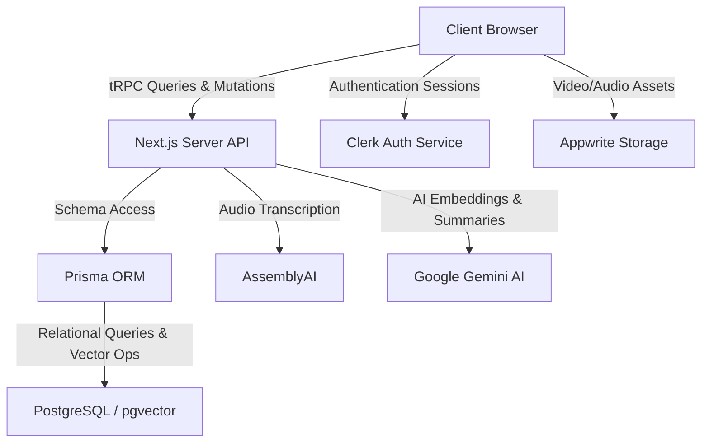

# System Architecture: GitBrain AI & PM Studio

This document details the software architecture of GitBrain, a codebase intelligence platform combined with a project management suite.

---

## 1. High-Level Architecture Overview

GitBrain is built as a unified Next.js web application utilizing a modern server-client boundary strategy. The system is split into three main layers:



### Key Layers
* **Presentation Layer (Next.js Client Components)**: React components built on top of Tailwind CSS, `shadcn/ui`, and `framer-motion`. Communicates with the server through type-safe queries.
* **API & Business Logic Layer (Next.js Server & tRPC)**: Houses the server actions, background tasks, and business logic. All database updates and external services (AI APIs, storage) are controlled here.
* **Data Access & Storage Layer (Prisma ORM & PostgreSQL)**: Relational database storing users, projects, commits, issues, sprint timelines, chat history, and codebase vector embeddings (via `pgvector`).

---

## 2. Dynamic Studio Routing Architecture

GitBrain separates its workspace into two environments: **AI Studio** (technical code intelligence) and **PM Studio** (project management). Both studios are dynamic and project-scoped.

### Directory Mapping
All workspace views are nested under a dynamic path parameter `[projectId]`, which is configured in Next.js as:
`src/app/(protected)/[projectId]/`

This dynamic routing enables paths like:
* `/[projectSlug]/dashboard` — AI Studio main hub
* `/[projectSlug]/pmstudio` — PM Studio (Kanban, Sprints, Sub-teams)
* `/[projectSlug]/qa` — Codebase Q&A chat sessions
* `/[projectSlug]/meetings` — Uploaded audio meetings and AI summaries

### Dynamic Slug Resolution
To provide clean, readable URLs, the dynamic folder `[projectId]` receives either the project's database **CUID** (e.g. `cmjffzixl000dvm1gyqxvfkvj`) or the **URL-encoded Project Name** (e.g. `gyano-ai`).
1. When a page mounts, the `useProject` hook reads the URL segment.
2. It looks up the project in the user's project list matching either criteria.
3. It extracts the raw database CUID to run server queries, keeping the URL formatted with the human-readable slug.
4. Redirect handlers at standard routes (like `/dashboard`) automatically forward users to the last active project's slug route.

---

## 3. Client State & Sync Hook (`useProject`)

The core of workspace synchronization resides in the `useProject` custom React hook:

```typescript
const useProject = () => {
    const { data: projects } = api.project.getProjects.useQuery();
    const [storedProjectId, setStoredProjectId] = useLocalStorage('GitBrainAI', ' ')
    const params = useParams()
    const urlParam = params?.projectId as string | undefined
    const decodedParam = urlParam ? decodeURIComponent(urlParam) : undefined

    // Match URL segment (by project name slug or direct CUID)
    const projectFromUrl = projects?.find(p => p.name === decodedParam || p.id === decodedParam)
    
    const project = projectFromUrl || projects?.find(p => p.id === storedProjectId)
    const projectId = project?.id || storedProjectId

    useEffect(() => {
        if (projectFromUrl && projectFromUrl.id !== storedProjectId) {
            setStoredProjectId(projectFromUrl.id)
        }
    }, [projectFromUrl, storedProjectId])

    return { projects, project, projectId, setProjectId: setStoredProjectId }
}
```

* **Local Storage Integration**: Ensures that if the user accesses a global page (e.g. `/create` or `/billing`), the sidebar remembers their last-accessed active project.
* **Context Consistency**: Because the hook is called globally in the sidebar layout, switching the active project updates the sidebar layout, navigation menus, and page queries simultaneously.

---

## 4. Subsystem Architectures

### A. RAG Search Subsystem
Processes repository file contents into search-ready vectors.
* **Loader**: Clones repository from GitHub, indexes file structure, and computes file tokens.
* **Embedding Engine**: Sends files to Gemini AI to generate a 768-dimension embedding.
* **Search Engine**: Executes cosine similarity search (`<=>` operator) in raw SQL to find the top 5 relevant files for any chat query.

### B. Meeting Audio Processor
Transcribes and analyzes team discussions.
* **Upload**: Encoded audio files are pushed to an Appwrite bucket with progress indicators.
* **Transcription Service**: A background job invokes AssemblyAI to extract speaker turns and text timestamps.
* **Action Item Generator**: Gemini parses the transcript to extract issues/tickets and assigns them directly to project sprints.

### C. Kanban & Sprint Timeline
Controls project planning tasks.
* **Automations Rules Engine**: Listens to task mutations (e.g. moving a task to "Done") and executes rule actions (e.g. assigning a QA person or triggering notification endpoints).
* **Scheduled Calls**: Scopes video calls in calendar cells and caches upcoming meetings to localStorage, isolated by project.
