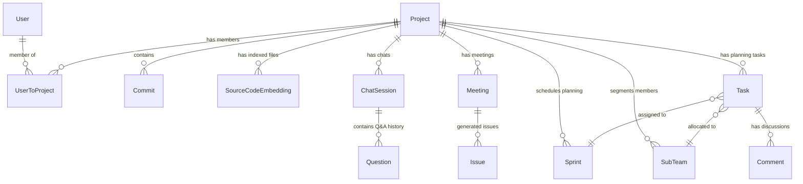
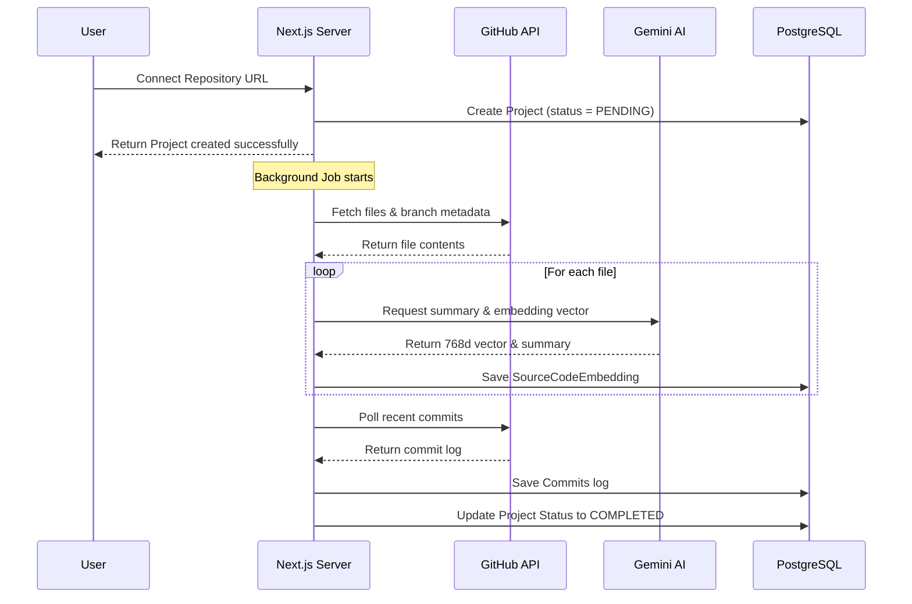
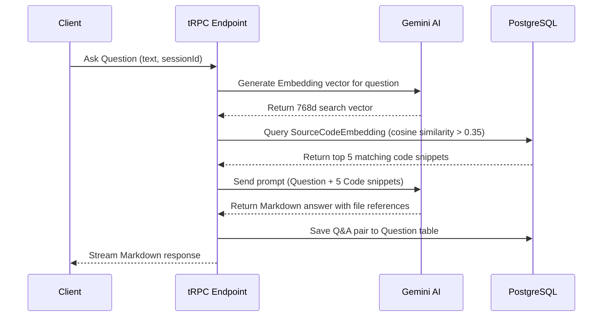
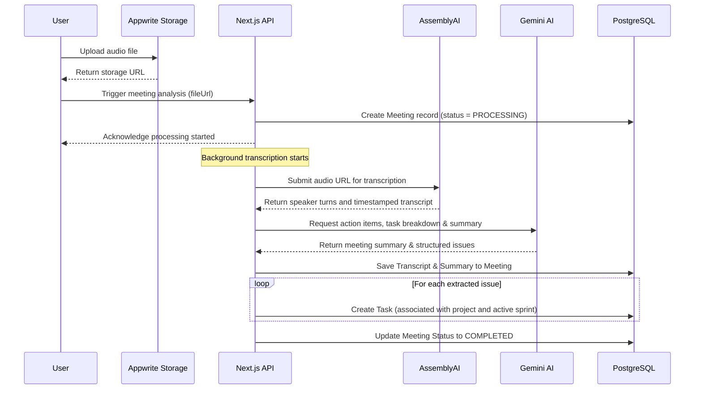

# System Design & Data Flow: GitBrain

This document details the database schema relationship, system components, and key data flows within GitBrain.

---

## 1. Database Schema Design (Prisma)

GitBrain utilizes a relational PostgreSQL database with `pgvector` extension for storing high-dimensional embeddings. Below is a simplified representation of the data models:

### Key Entities
* **Project**: The core tenant entity. Tracks metadata such as `githubUrl`, GitHub auth token reference, branch, indexing status, and soft deletion.
* **SourceCodeEmbedding**: Represents an indexed file. Stores the `fileName`, `summary`, raw `sourceCode`, and `summaryEmbedding` (type `Unsupported("vector(768)")`).
* **Task**: An issue/ticket in PM Studio. Holds properties for `title`, `description`, `status` (`TODO`, `IN_PROGRESS`, `DONE`), `priority` (`LOW`, `MEDIUM`, `HIGH`, `URGENT`), and timestamps.
* **Sprint**: Groups tasks into timeboxes with `startDate` and `endDate`.

---

## 2. Key Data Flow Diagrams

### A. Codebase Indexing Pipeline
When a user connects a GitHub repository, the system triggers a background indexing job:

---

### B. Codebase Q&A (RAG Search Flow)
When a user asks a question about their code:

---

### C. Meeting Upload & Issue Generation Flow
When a team uploads an audio meeting standup:

